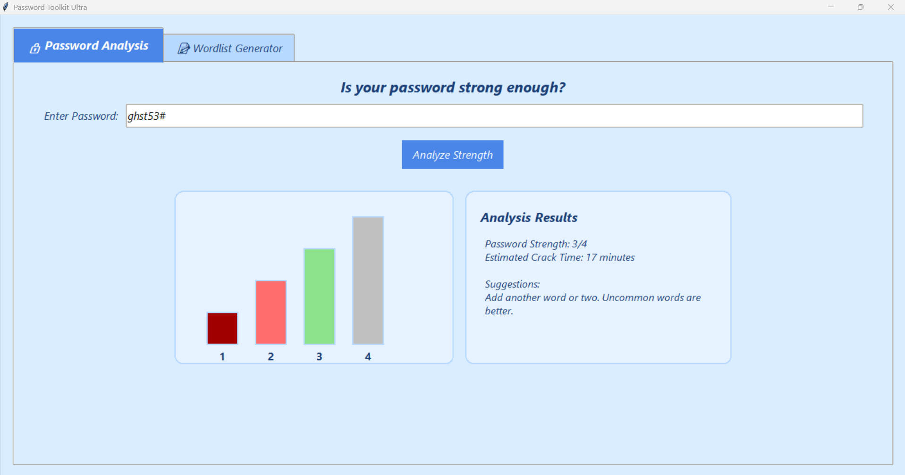
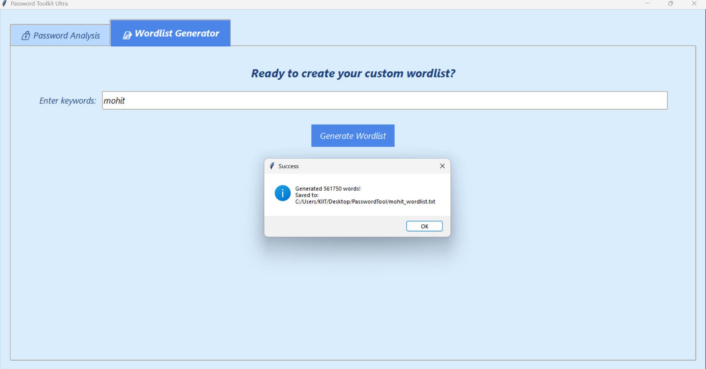
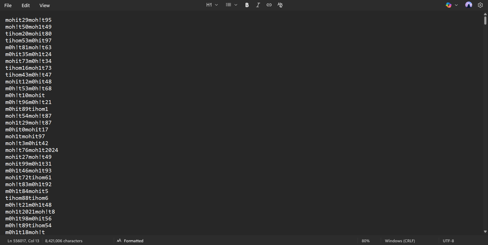

#  Password Toolkit Ultra

A powerful and customizable Python tool to **analyze password strength** and **generate custom wordlists**. Comes with an intuitive **GUI (Tkinter)** and a **full-featured CLI** for automation.

---

##  Key Features

*** Password Strength Analyzer***
  Analyze the strength of any password instantly using [zxcvbn](https://github.com/dropbox/zxcvbn), which uses pattern matching and heuristics based on real-world password data.

** Entropy-Based Estimation**
  Get crack time estimates, entropy values, and actionable feedback on weak passwords.

** Custom Wordlist Generator**
  Build massive personalized wordlists using user-provided keywords (e.g., names, dates, pets), leetspeak transformations, and suffix variations (like birth years, common symbols, numbers).

** Wordlist Export**
  Easily export generated wordlists in `.txt` format compatible with password recovery/cracking tools such as John the Ripper and Hashcat.

** Modern GUI and CLI**
  Choose between a user-friendly Tkinter interface or a scriptable command-line interface using `argparse`.

** Fast and Lightweight**
  Works entirely offline, requires minimal system resources, and ensures full data privacy.

---

##  Screenshots

###  Password Analyzer



###  Wordlist Generator



###  Sample Wordlist Output



---

##  Installation

1. **Clone this repository**

   ```bash
   git clone https://github.com/yourusername/password-toolkit-ultra.git
   cd password-toolkit-ultra
   ```

2. **Install Python 3.x**
   Download it from: [https://www.python.org/downloads/](https://www.python.org/downloads/)

3. **Install required dependencies**

   ```bash
   pip install -r requirements.txt
   ```

   **requirements.txt**

   ```
   zxcvbn
   nltk
   ```

---

##  Usage Guide

###  Run GUI Version

Launch the graphical interface:

```bash
python password_analyzer.py
```

###  Command Line Usage

* **Analyze a password:**

  ```bash
  python password_analyzer.py analyze "YourPassword"
  ```

* **Generate a wordlist:**

  ```bash
  python password_analyzer.py generate "name,birthday,pet" --output wordlist.txt
  ```

---

##  How It Works

###  Password Strength Analyzer

* Utilizes `zxcvbn` for deep strength evaluation based on common passwords, keyboard patterns, names, and dictionary words.
* Provides:

  * Strength score (0–4)
  * Estimated crack time
  * Entropy
  * Suggestions for stronger passwords

###  Wordlist Generator

* Input: comma-separated keywords (e.g., `mohit,1998,fluffy`)
* Process:

  * Applies leetspeak rules (`a → @`, `e → 3`, etc.)
  * Adds suffixes (e.g., `123`, `@`, `!`, common years)
  * Generates combinations and permutations
* Output: A large `.txt` wordlist for dictionary attacks or password testing

---

##  FAQ

**Q: Can I use the wordlist with Hashcat or John the Ripper?**
**A:** Yes! The generated `.txt` files are fully compatible.

**Q: Does this tool send or store any of my data online?**
**A:** No. Everything runs locally. Your data remains completely private.

**Q: Can I modify the wordlist rules or patterns?**
**A:** Absolutely. Edit `wordlist_generator.py` to change leet rules, suffixes, and combination logic.

---

##  Contributing

We welcome community contributions!
If you want to report a bug, suggest a feature, or contribute code:


---

##  Author

**Mohit Kumar**

